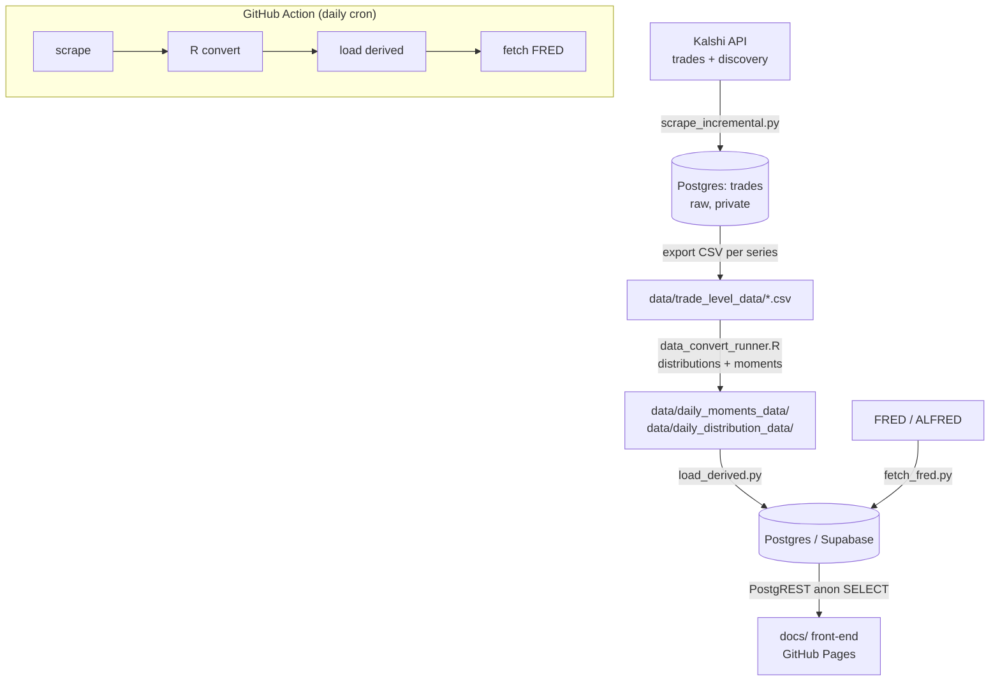

# macro_kalshi — Kalshi macro prediction markets: data pipeline & live dashboard

> **Built on the work of Anthony M. Diercks and Jared Dean Katz** (Federal Reserve
> Board of Governors; Northwestern University, Kellogg School of Management). The
> economic idea, the methodology for turning Kalshi contract prices into
> market-implied probability distributions, and the original data pipeline are
> **theirs**, from the replication package for **Diercks, Katz & Wright (2026),
> _"Kalshi and the Rise of Macro Markets"_**
> ([NBER Working Paper 34702](https://www.nber.org/papers/w34702)). This repository
> is a self-hosted fork of
> [`jdkatz21/Prediction_Markets_Public`](https://github.com/jdkatz21/Prediction_Markets_Public)
> that keeps their method intact and adds a live-updating back-end and dashboard on
> top of it. Please **cite the authors** ([§14](#14-credits-license--citation)).

This project scrapes Kalshi's economic-indicator prediction markets, uses the
authors' R methodology to convert traded contract prices into full
**market-implied probability distributions** and their moments, overlays the
**realized outcome** from FRED, and publishes everything to an interactive
dashboard that reads the data live from a Postgres/Supabase back-end.

- **Live site:** https://willbtk.github.io/macro_kalshi/
- **Upstream (forked from):** [`jdkatz21/Prediction_Markets_Public`](https://github.com/jdkatz21/Prediction_Markets_Public)

> **Scope of "replication."** Two layers live in this repo, and they reproduce
> very differently:
> 1. **The data pipeline + dashboard** (this README's main subject) is fully
>    reproducible from **Kalshi + FRED alone** — the only two data sources it needs.
> 2. **The paper's econometric exhibits** (`code/analysis/**`) reproduce
>    figures/tables of the NBER paper but depend on **external data this package
>    does not ship** — San Francisco Fed USMPD monetary-policy shocks and Bloomberg
>    survey surprises — and are cataloged honestly in
>    [§12](#12-paper-exhibit--analysis-layer) but are **not** turnkey.

---

## Table of contents

1. [The paper](#1-the-paper)
2. [Relationship to the original work — credit & what this fork adds](#2-relationship-to-the-original-work--credit--what-this-fork-adds)
3. [What this repo produces](#3-what-this-repo-produces)
4. [Quick start](#4-quick-start)
5. [Methodology — from contract prices to distributions](#5-methodology--from-contract-prices-to-distributions)
6. [Data sources](#6-data-sources)
7. [Architecture & data flow](#7-architecture--data-flow)
8. [Series catalog](#8-series-catalog)
9. [Repository layout](#9-repository-layout)
10. [Reproduce it yourself](#10-reproduce-it-yourself)
11. [Database schema](#11-database-schema)
12. [Front-end](#12-front-end)
13. [Paper-exhibit / analysis layer](#13-paper-exhibit--analysis-layer)
14. [Limitations, gotchas & design decisions](#14-limitations-gotchas--design-decisions)
15. [Credits, license & citation](#15-credits-license--citation)

---

## 1. The paper

Kalshi is a CFTC-regulated US exchange where binary/threshold contracts pay out
based on the realized value of a macroeconomic release (a CPI print, an FOMC
target range, the unemployment rate, etc.). Because contracts are listed at a
ladder of strikes, the cross-section of prices on any given day traces out the
**market's probability distribution** over the upcoming release — not just a
point forecast.

Diercks, Katz & Wright (2026) use these markets to study how macro expectations
form and update: the term structure of forward curves, how distributions react
to monetary-policy communication and data surprises, and anomalies such as
apparent informed trading ahead of releases. Their public replication package
provides the code to reconstruct the distributional data at the center of that
work. This repo builds directly on that package and keeps it updating daily, so
the market-implied forecasts can be tracked and compared against what actually
happened.

## 2. Relationship to the original work — credit & what this fork adds

**This is a derivative work.** The intellectual core belongs to the original
authors and is used here largely unchanged. To be precise about the boundary:

### What is the original authors' work (unchanged in substance)

- **The economic idea** — reading market-implied macro distributions off Kalshi's
  strike ladders — and the paper that develops it.
- **The distribution methodology** — the R conversion in
  `code/convert_trades_to_pdfs/`: daily aggregation, no-arbitrage **"middle-out"**
  CDF cleaning, CDF→PMF differencing, and the moment definitions (including the
  Groeneveld–Meeden skewness and the half-bin continuity correction). This is the
  heart of the project and it is **theirs**. See [§5](#5-methodology--from-contract-prices-to-distributions).
- **The Kalshi scraping approach** — RSA-signed trade requests, ticker discovery
  across events/markets endpoints, and the two-endpoint historical/live trade pull.
- **The original weekly GitHub Action** and the reference front-end concept.

### What this fork contributes (on top of their work)

**Implementation / re-homing** (engineering, not new science):

- **A Postgres/Supabase back-end** as the system of record, replacing the upstream
  S3 CSV bucket. The scraper writes raw trades to Postgres; derived moments and
  distributions are loaded into tables the front-end reads live via PostgREST, gated
  by row-level-security policies. See [§7](#7-architecture--data-flow), [§11](#11-database-schema).
- **A from-scratch interactive dashboard** (`docs/`) — where much of this fork's
  original effort went. It renders the fan of forward curves, the realized line,
  the first-release **settlement** line, and **uncertainty/skew** and
  **constant-maturity** views, reading the database directly in the browser. See
  [§12](#12-front-end).
- **A daily** (rather than weekly) Action, with a concurrency guard and a
  self-keepalive so the schedule isn't auto-disabled.

**Expansion of the authors' ideas:**

- **Three added series** — quarterly real GDP (`KXGDP`), nonfarm payrolls
  (`KXPAYROLLS`), and headline CPI MoM (`KXCPI`) — wired through the same
  methodology.
- **A first-release "settlement" overlay** — pulling ALFRED first-vintage values
  so the dashboard can show *where an expired contract actually settled* (the value
  as first reported, before revisions), alongside the revised FRED series.
- **Constant-maturity ("N-th out") and uncertainty/skew views** built on the
  authors' moments, holding the forecast horizon fixed so changes reflect genuine
  shifts in uncertainty rather than term-structure slope.

**Genuine corrections & a speedup** (called out explicitly, per honest attribution):

- **Bug fix — undefined `count_fp`.** The R converters referenced an undefined
  `count_fp` during daily aggregation; the live Kalshi feed's column is `count`.
  Fixed by deriving `count_fp` when absent (without this the R step errors out).
- **Bug fix — FRED first-release fetch.** FRED returns HTTP 400 when a first-release
  request is combined with a units transform (and for never-revised series). Fixed
  by fetching first-release **levels** and computing YoY/MoM/change in Python, with
  a fallback for series that have no vintages.
- **Robustness — credential loading.** The scraper now loads `env.env` locally,
  accepts an inline PEM or a key file, and fails with clear errors — previously it
  effectively only worked inside GitHub Actions.
- **Speedup — incremental scrape.** Instead of re-scraping full history every run,
  the scraper tracks a per-series high-water-mark and appends only new trades
  (de-duped on `trade_id`), saving the bulk of each run's time.

Everything statistical downstream of the scrape is the authors' method; the fork's
value-add is the data-visualization front-end, the database back-end, the added
series, and the settlement overlay.

## 3. What this repo produces

For each of nine economic series, the pipeline emits three kinds of derived data,
served live to the dashboard:

- **Daily moments** — for every contract, on every trading day, the mean, median,
  mode, variance (→ implied standard deviation), skewness and kurtosis of the
  market-implied distribution, plus volume.
- **Daily distributions** — the full probability mass function over strikes, per
  contract per day.
- **Realized & first-release overlays** — the actual outcome from FRED (revised
  series) and the **value as first reported** (used to draw where an expired
  contract *settled*, before revisions).

## 4. Quick start

You cannot run the live scrape from a restricted sandbox (Kalshi and CRAN egress
are commonly blocked); use a local machine or GitHub Actions. To reproduce the
full pipeline:

```bash
# 1. Python + R deps (see §10 for exact versions)
pip install pandas python-dotenv cryptography requests websockets psycopg2-binary
Rscript -e 'install.packages(c("tidyverse","lubridate","matrixStats","collapse","DescTools"))'

# 2. Credentials (see §10): Kalshi API key + RSA PEM, a Postgres/Supabase DB, a FRED key
cp env.env.example env.env         # then edit

# 3. Run the pipeline stages (same order as the GitHub Action)
python code/kalshi_scraping/scrape_incremental.py          # Kalshi -> Postgres(raw) -> trade CSVs
Rscript code/convert_trades_to_pdfs/data_convert_runner.R  # CSVs -> distributions + moments
python code/kalshi_scraping/load_derived.py                # derived CSVs -> Postgres
python code/kalshi_scraping/fetch_fred.py                  # FRED realized + first-release -> Postgres
```

The GitHub Action `.github/workflows/daily-data.yml` runs exactly these steps on
a daily cron. The front-end (`docs/`) needs no build — it reads the DB directly.

## 5. Methodology — from contract prices to distributions

This is the authors' core technique. The R code in `code/convert_trades_to_pdfs/`
turns a stream of individual trades into a clean daily probability distribution per
contract. There are **two market shapes**, handled by two converters.

### 5.1 Threshold / CDF markets (the common case)

Series: FFR, CPI YoY (headline & core), CPI MoM, unemployment, nonfarm payrolls,
quarterly GDP. Each listed strike is a contract that pays if the outcome is **≥
that strike**, so a strike's `yes` price is a point on the **complementary CDF**
(`P(outcome ≥ strike)`). `extract_distributions()` proceeds:

1. **Parse & rescale.** Kalshi reports prices in dollars post-March-2026; they're
   rescaled to the 1–99 cent convention (`yes_price = yes_price_dollars * 100`).
   The strike is parsed from the ticker suffix (`-T2.5`; `N` denotes a negative
   strike, e.g. GDP `-TN0.5`; payrolls use literal negatives like `-T-100000`).
   An optional `strike_scale` normalizes units (payrolls use `0.001` to express
   strikes in **thousands of jobs**, matching FRED's `PAYEMS` change).

2. **Daily aggregation.** One value per `(contract, strike, day)`. Default method
   is **last trade of the day**; `VWAP` (volume-weighted by contract count) is
   available. Volume is the summed contract count.

3. **Fill missing days.** Build the full `(contract × strike × day)` grid, carry
   the last observed price forward (filled days get zero volume), and trim to a
   window of **`days_before_horizon`** days before the contract's
   expiry/resolution (e.g. 180 for FFR, 30 for CPI, 45 for payrolls, 400 for
   quarterly GDP).

4. **No-arbitrage "middle-out" cleaning.** A valid CDF must be **non-increasing
   in strike** (a lower threshold subsumes a higher one). Instead of sweeping
   monotonicity from one tail, the default anchors at the bin whose price is
   closest to the median (**49**, since prices are 1–99), argued to be the most
   liquid/reliable, then enforces monotonicity **outward in both directions**: a
   running `cummax` walking down toward lower strikes (prices must rise) and a
   running `cummin` walking up toward higher strikes (prices must fall). This
   trusts the liquid center over noisy tails.

5. **Difference the CDF into a PMF.** A synthetic bin just below the lowest strike
   is added (so sub-lowest mass isn't dumped at 0), then adjacent cumulative
   prices are differenced: interior bin `i` gets
   `adjusted_yes_price[i] − adjusted_yes_price[i+1]` = the probability the outcome
   lands in `[strike_i, strike_{i+1})`; the tails get the residual mass. The
   strike grid is completed on an integer lattice spaced by **`strike_int`**
   (0.25 FFR, 0.1 CPI/unemployment, 0.5 GDP, 50 payrolls), zero-filling any skipped
   strikes. A "swap" pass nudges isolated mass toward the modal center to keep the
   distribution connected, then the PMF is normalized to 100.

6. **Moments** (probability-weighted over strikes):
   - **Mean** `Σp·x / Σp`, **median** (step CDF, no interpolation), **mode**
     (weighted), each plus a **`moment_adjustment`** — a half-bin **continuity
     correction** (≈ `strike_int/2`) added to *location* moments only, because a
     strike labels the *lower edge* of its payoff bin, so the expected value sits
     inside the bin.
   - **Variance** `Σp·(x−μ)² / Σp`.
   - **Skewness** is the nonparametric **Groeneveld–Meeden** measure
     `(mean − median) / MAD`, in [−1, 1] — not the standardized third moment.
   - **Kurtosis** via `DescTools::Kurt` (weighted).

### 5.2 Bracket / PDF markets

Series: **annual CPI end-of-year** (`KXACPI`) and **annual GDP end-of-year**
(`KXGDPYEAR`). Here Kalshi lists **mutually-exclusive brackets**, so each strike's
price is *already* a per-bracket probability mass. The converter therefore skips
all CDF machinery — no monotonicity enforcement, no differencing. It aggregates
daily by **VWAP**, uses bin **midpoints** as the support (with a few known
mislabeled tickers corrected), renormalizes the prices to 100, and computes the
same moments over midpoints (no `moment_adjustment`, since midpoints already center
the mass).

### 5.3 Forward curves & settlement (front-end)

- A **forward curve** is one "as-of" snapshot: fix a past date `T`, and for every
  contract take the moment value from its trading observation nearest `T` (within
  ~45 days); plotting those against each contract's target date gives the
  market-implied **term structure** as of `T`. Stepping `T` back monthly/quarterly
  (or by release/meeting date) produces the fan of historical curves.
- The **settlement** value for an *expired* contract is its **first-release**
  outcome — the value as first reported before revisions — matched from FRED/ALFRED
  vintages to the contract's expiry.

See [§12](#12-front-end) for the rendering details.

## 6. Data sources

Only **two** live data sources feed the pipeline and dashboard.

### 6.1 Kalshi API

- **Host / prefix:** `https://api.elections.kalshi.com/trade-api/v2` (production).
- **Authentication (trades):** RSA-PSS signing. The client signs the string
  `timestamp_ms + HTTP_METHOD + path` (query string excluded) with `MGF1(SHA256)`,
  digest salt length, SHA-256, base64 — sent as headers `KALSHI-ACCESS-KEY`,
  `KALSHI-ACCESS-SIGNATURE`, `KALSHI-ACCESS-TIMESTAMP`. Trade endpoints, balance,
  exchange status and the WebSocket are authenticated; **market/event discovery is
  public** (unauthenticated).
- **Endpoints used:** `/events`, `/historical/markets`, `/markets` (public, ticker
  discovery); `/historical/trades` + `/markets/trades` (authenticated, the two
  trade feeds, concatenated and de-duplicated on `trade_id`); `/historical/cutoff`
  (how far back history is available); `/series/{s}/markets/{t}/candlesticks`
  (public, daily bid/ask OHLC for the order-book converter).
- **March 2026 API change.** Kalshi split trade access into `/historical/trades`
  and live `/markets/trades`. The scraper pulls both. Empirically a fresh scrape
  still reconstructs multi-year history (CPI back to Dec 2022); verify per series
  at run time via `/historical/cutoff`.

### 6.2 FRED / ALFRED (realized & first-release)

`code/kalshi_scraping/fetch_fred.py` pulls each series' realized underlying from
FRED (requires a free `FRED_API_KEY`):

- **Revised realized** (`underlying_history`): the current series in the right
  transform — `lin` (level), `pc1` (YoY %), `pch` (MoM %), or `chg` (change).
- **First-release / settlement** (`underlying_first_release`): the value **as first
  reported**, from ALFRED vintages. Because FRED rejects a first-release fetch
  combined with a units transform, the code fetches first-release **levels** and
  computes the YoY/MoM/change in Python; for a never-revised series (e.g. the Fed
  target) first-release == current, so it falls back to the regular fetch.
  (Approximation notes: first-release CPI YoY/MoM sit a hair off the reported print
  since the index is barely revised; payrolls change is within one prior-month
  revision, since the reported change nets against a revised prior month.)

### 6.3 External data (paper exhibits only — not shipped)

The `analysis/**` exhibit scripts additionally reference **SF-Fed USMPD**
monetary-policy shocks and **Bloomberg** survey surprises. These are **not** Kalshi
or FRED, are **not** included in this package, and are not needed for the pipeline
or dashboard. See [§13](#13-paper-exhibit--analysis-layer).

## 7. Architecture & data flow



Data lands in **Postgres (Supabase)**, and the static front-end queries it live
via PostgREST using a publishable anon key gated by row-level-security policies.
The raw `trades` table and per-market `markets` table stay **private**; only the
derived tables and a `contract_expiry` view are exposed to the `anon` role.

> **Note on the retired design.** The upstream package `aws s3 sync`ed derived CSVs
> to a public bucket that the reference site read from; an intermediate version of
> this fork committed the CSVs back into the repo instead. Both are **superseded**
> by the Postgres/Supabase store described here — the derived CSVs are now an
> intermediate artifact between the R step and the DB loader, not the system of
> record. `SELF_HOSTING.md` documents that earlier stage and is partly historical.

## 8. Series catalog

`code/kalshi_scraping/series_config.py` is the single source of truth mapping each
series to its Kalshi ticker, FRED series, and the R conversion parameters.

| Key | Kalshi ticker | Market type | FRED id (units) | R params (`strike_int` / `horizon` / `moment_adj` / `scale`) | Resolves to |
|---|---|---|---|---|---|
| `fed_levels` | `KXFED` | threshold | `DFEDTARU`+`DFEDTARL`/2 (lin) | 0.25 / 180 / 0.125 / — | FOMC target-range **midpoint** |
| `headline_cpi_releases` | `KXCPIYOY` | threshold | `CPIAUCSL` (pc1) | 0.1 / 30 / 0.1 / — | Headline CPI **YoY** |
| `core_cpi_releases` | `KXCPICOREYOY` | threshold | `CPILFESL` (pc1) | 0.1 / 30 / 0.1 / — | Core CPI **YoY** |
| `headline_cpi_releases_mom` | `KXCPI` | threshold | `CPIAUCSL` (pch) | 0.1 / 30 / 0.1 / — | Headline CPI **MoM** (SA) |
| `headline_cpi_end_of_year` | `KXACPI` | **bracket** | `CPIAUCSL` (pc1) | (PDF path) | Annual headline CPI, end-of-year |
| `gdp_end_of_year` | `KXGDPYEAR` | **bracket** | `A191RL1A225NBEA` (lin) | (PDF path) | Annual real GDP growth (advance) |
| `unemployment_releases` | `KXU3` | threshold | `UNRATE` (lin) | 0.1 / 30 / 0.1 / — | U-3 unemployment rate |
| `gdp_quarterly` | `KXGDP` | threshold | `A191RL1Q225SBEA` (lin) | 0.5 / 400 / 0.25 / — | Real GDP **q/q SAAR** (advance) |
| `nonfarm_payrolls` | `KXPAYROLLS` | threshold | `PAYEMS` (chg) | 50 / 45 / 25 / 0.001 | Monthly change in payrolls (000s) |

## 9. Repository layout

```
code/
  kalshi_scraping/
    clients_kalshi.py       # Kalshi HTTP/WS client: RSA-PSS signing, retry, pagination
    tickers.py              # ticker discovery: events -> historical/markets -> live markets
    finding_tickers.py      # simpler live-markets ticker lister
    series_config.py        # SERIES: key -> Kalshi ticker, CSV names, FRED id/units
    scrape_incremental.py   # incremental scrape -> Postgres(trades) -> export trade CSVs
    scrape_kalshi_trades.py # standalone full trade scraper (per-series CSVs)
    orderbook_scraping.py   # public candlesticks -> bid/ask OHLC CSV (order-book path)
    load_derived.py         # derived CSVs -> Postgres (daily_moments, daily_distributions)
    fetch_fred.py           # FRED realized + ALFRED first-release -> Postgres
    db.py                   # schema, RLS/grants, connection, upsert/replace helpers
  convert_trades_to_pdfs/
    data_convert_runner.R           # driver: calls extract_distributions per series
    convert_trade_level_data_cdfs.R # CDF/threshold path (middle-out cleaning + moments)
    convert_trade_level_data_pdfs.R # PDF/bracket path (annual CPI/GDP)
    convert_bid_ask_data_cdfs.R     # CDF path from bid/ask candlesticks (midpoint)
  analysis/                 # paper exhibits (see §13 — needs external data, not shipped)
  insider_trading/          # intraday distribution construction (Kalshi-only)
  utilities.R               # base-R plotting helpers
docs/                       # static front-end (GitHub Pages)
  index.html                # the whole app (markup + styles + logic; Plotly via CDN)
  config.js                 # Supabase URL + publishable anon key + per-series metadata
.github/workflows/
  daily-data.yml            # the daily pipeline
  pages.yml                 # deploy docs/ to GitHub Pages
data/                       # git-ignored working dirs (raw trades, derived CSVs)
SELF_HOSTING.md             # deep-dive on the data layer (partly superseded — see §7)
```

## 10. Reproduce it yourself

### 10.1 Prerequisites

- **Python 3.11** with: `pandas python-dotenv cryptography requests websockets psycopg2-binary`
- **R** (4.3+) with: `tidyverse lubridate matrixStats collapse DescTools`
  (`DescTools` comes from CRAN/Posit — some minimal environments lack it via apt).
- A **Postgres** database. The project uses **Supabase** (its Session pooler), but
  any Postgres works — the front-end's live-query convenience is what ties it to
  Supabase/PostgREST.
- A full first build takes **~1.5 hours** (dominated by the initial history scrape).

### 10.2 Credentials

| Secret | Used by | How to get it |
|---|---|---|
| `KALSHI_KEYID` + RSA private key PEM | scraper | Kalshi developer portal → create API key (Key ID + a downloaded `.pem`) |
| `FRED_API_KEY` | `fetch_fred.py` | Free from the St. Louis Fed FRED site |
| `SUPABASE_DB_PASSWORD` (required) + `SUPABASE_DB_URL` (or discrete `SUPABASE_DB_*`) | DB loaders | Your Supabase/Postgres project |

**Local:** copy `env.env.example` → `env.env` (git-ignored) and set `KALSHI_KEYID`
plus either `KALSHI_KEYFILE` (path to the `.pem`) or `KALSHI_PRIVATE_KEY` (inline
PEM). Add the FRED and Supabase values to your environment.

**GitHub Actions:** add repo secrets `KALSHI_KEYID`, `KALSHI_PRIVATE_KEY` (full
PEM), `FRED_API_KEY`, `SUPABASE_DB_URL`, `SUPABASE_DB_PASSWORD`. **Never commit the
private key.**

### 10.3 Running

Run the four stages in the order shown in [§4](#4-quick-start). Notes:

- **First run seeds full history** (empty DB → both trade feeds pulled per series);
  **later runs are incremental** (only trades newer than the stored high-water-mark,
  with a 5-second overlap; `trade_id` de-dupes). `db.ensure_schema()` creates tables,
  RLS policies and grants idempotently on every run.
- The R step **recomputes full history each run** and the loader **replaces each
  series in full**, so the derived tables are always internally consistent.
- `fetch_fred.py` runs independently of the scrape (it still updates realized data
  even when no new trades were found).

### 10.4 Scheduling & deploy

- `daily-data.yml` runs on cron `30 22 * * *` (22:30 UTC, after the US close), with
  a `concurrency` group so two runs never write at once, and a keepalive step that
  pushes an occasional empty commit so the schedule isn't auto-disabled after 60
  idle days.
- `pages.yml` deploys `docs/` to GitHub Pages on any push to `main` touching
  `docs/**` (or the workflow itself). The front-end reads the DB live, so **data
  updates do not require a redeploy** — only front-end code changes do.

## 11. Database schema

Defined in `code/kalshi_scraping/db.py`.

| Table / view | Key columns | Exposed to `anon`? | Purpose |
|---|---|---|---|
| `trades` | `trade_id` PK, `series`, `ticker`, `created_time`, `count_fp`, `yes/no_price_dollars`, `taker_side` | **No (private)** | Raw trades; dedupe key `trade_id` |
| `markets` | `ticker` PK, `series`, `close_time`, `expiration_time` | **No (private)** | Per-market close/expiry metadata |
| `daily_moments` | (`series`,`contract_preamble`,`date`) PK, `expiry_date`, `daily_volume`, `mean/median/mode/skewness/kurtosis/variance` | **Yes** | Distribution moments per contract/day |
| `daily_distributions` | (`series`,`contract_preamble`,`date`,`strike`) PK, `probability`, `yes_price`, `adjusted_yes_price`, `daily_volume` | **Yes** | PMF over strikes |
| `underlying_history` | (`series`,`date`) PK, `value` | **Yes** | Revised realized outcome (FRED) |
| `underlying_first_release` | (`series`,`date`) PK, `value`, `released` | **Yes** | First-release (settlement) values |
| `contract_expiry` (view) | `series`, `contract_preamble`, `expiry` | **Yes** | True per-contract expiry, aggregated from private `markets` |

Row-level security is enabled on the four derived tables with a `public_read`
`SELECT USING (true)` policy, plus `GRANT SELECT … TO anon, authenticated`; the
`contract_expiry` view exposes an aggregate of `markets` while keeping the base
table private. All policy/grant statements are wrapped so re-runs and missing
Supabase roles don't error.

**Connection:** `db.connect()` reads discrete `SUPABASE_DB_{HOST,USER,NAME,PORT,
PASSWORD}` env vars, backfilling any unset field from `SUPABASE_DB_URL`, falling
back to the project's non-secret pooler defaults. **`SUPABASE_DB_PASSWORD` is the
only mandatory secret.** Connections use `sslmode=require`.

## 12. Front-end

`docs/index.html` is the entire app (no build step); `docs/config.js` holds the
Supabase URL, the **publishable anon key** (safe in client code — it only grants
what RLS allows), and per-series display metadata (`label`, `unit`, `axis`, and a
plain-English `spec` of what each contract resolves to). Plotly 2.35.2 is the only
external dependency (CDN).

- **Data fetching.** `pgFetch(table, query)` hits PostgREST at
  `${SUPABASE_URL}/rest/v1/${table}?…`, paginating in 1000-row pages. It reads
  `daily_moments`, `underlying_history`, `underlying_first_release` and
  `contract_expiry` per series, and `daily_distributions` per selected contract.
- **Forward curves.** The fan is built by snapshotting each past "as-of" date and,
  for each contract, taking the moment value from its observation nearest that date
  (within ~45 days); the latest snapshot is the **current** curve (orange), history
  is uniform grey, and the **realized** FRED line is drawn in near-black. Cadence
  (monthly / quarterly / event-day / day-before), central tendency (mean/median/
  mode) and a minimum-volume filter are user-selectable; the default x-range starts
  12 months before the earliest market data.
- **Settlement line.** For an expired contract, `settleValue()` matches the nearest
  first-release value (within 120 days of expiry) and draws a dotted horizontal line
  with a `settled X` annotation — "where it actually settled, value as first
  reported, before revisions."
- **Uncertainty & skew tab.** Plots implied s.d. or (Groeneveld–Meeden) skew as a
  term structure **by horizon**, **over time** per contract, or at **constant
  maturity** ("N-th out"), which holds the forecast horizon fixed so moves reflect
  genuine changes in uncertainty rather than term-structure slope.
- **Tiles.** Latest realized value (date-stamped by series frequency), mean/median/
  implied-s.d. for the selected day, days-to-release, and total volume.

To enable Pages: Settings → Pages → deploy from `main`/`docs` (or use the included
`pages.yml` Actions deploy). Publishes at `https://willbtk.github.io/macro_kalshi/`.

## 13. Paper-exhibit / analysis layer

`code/analysis/**` and `code/insider_trading/` reproduce figures/tables from the
NBER paper. **Most are not runnable from the shipped Kalshi+FRED data** — they were
written against the authors' full research tree and reference external inputs this
package does not (and cannot) redistribute. Documented honestly:

| Script | Reproduces | Extra data needed | Runnable as shipped? |
|---|---|---|---|
| `stagflation/stagflation.R` | 2025 year-end CPI/GDP expectations & stagflation probabilities vs SPF/Blue Chip | SPF/Blue Chip values are **hardcoded inline** | **Yes** ✅ (repoint its `source()` to `code/utilities.R`) |
| `insider_trading/insider_trading_dist_construction.R` | Intraday (6-hour) distribution construction | Kalshi trade CSVs only | **Partial** — only the headline-CPI input ships |
| `analysis/insider_trading/detecting_insider_trading.R` | Conditional-probability table of informed trading | **Bloomberg** `bb_*` surprises + hourly moments | No |
| `analysis/reaction_to_news/mps_*.R` (×4) | Regressions of moment changes on monetary-policy shocks | **SF-Fed USMPD** `mps.csv` / `usmpd_data.xlsx` + `_middle_out` moments | No |
| `analysis/reaction_to_news/news_exhibit.R` | Reaction to data surprises | **Bloomberg** `bb_news_surprises.csv` | No |
| `analysis/bid_ask_v_trade/*.R` | Trade vs bid/ask information arrival | bid/ask moments (dirs ship empty); FFR file marked `# Not finished` | No |

Common gotchas if you adapt them: they set `setwd('~/Documents/Research/…')` and
`source('~/Documents/Research/Utilities/utilities.R')` (an absolute path **outside**
this repo — the in-repo equivalent is `code/utilities.R`), and several expect a
`data/external_data/` directory and `_middle_out` / `hourly_*` moment variants that
are not produced by the default pipeline.

## 14. Limitations, gotchas & design decisions

- **Restricted sandboxes can't run it.** Egress policies often block
  `api.elections.kalshi.com` and CRAN/Posit — run on GitHub Actions or locally.
- **First-release approximations.** Payrolls first-release change is within one
  prior-month revision; SA MoM CPI can print negative in soft months — both are
  expected, not bugs.
- **`swapped` column leak.** The CDF converter's internal `swapped` working flag is
  harmless but currently written into the long distributions CSV.
- **Order-book path is vestigial.** `orderbook_scraping.py` writes a bid/ask CSV
  (CPI only) and the bid/ask converter calls are commented out in the runner; the
  live dashboard is trade-based.
- **API-change risk.** Kalshi's March 2026 endpoint split is handled, but confirm
  `/historical/cutoff` per series if history looks truncated.
- **Keepalive commits.** The daily job pushes an empty commit only when the repo
  nears GitHub's 60-day scheduled-workflow cutoff.

## 15. Credits, license & citation

This repository builds on the replication package by **Anthony M. Diercks and Jared
Dean Katz** (Federal Reserve Board of Governors; Northwestern University, Kellogg
School of Management). The distribution methodology, the original scraping pipeline,
and the research idea are their work; this fork adds the database back-end, the
dashboard, three series, and the settlement overlay ([§2](#2-relationship-to-the-original-work--credit--what-this-fork-adds)).
The upstream code is distributed under the MIT License. Academic software, provided
**as is**, without warranty; verify data against official sources.

If you use this code or data in published work, please cite the authors:

> Diercks, A. M., Katz, J. D., & Wright, J. H. (2026). *Kalshi and the Rise of
> Macro Markets.* NBER Working Paper 34702.

See also `SELF_HOSTING.md` for a deeper walk-through of the data layer and the
self-hosting changes, and `docs/README.md` for front-end specifics.

---

*The views and analysis here are those of this fork's maintainer and do not
represent the Federal Reserve Board or the original authors. Prediction-market data
is not investment advice.*
